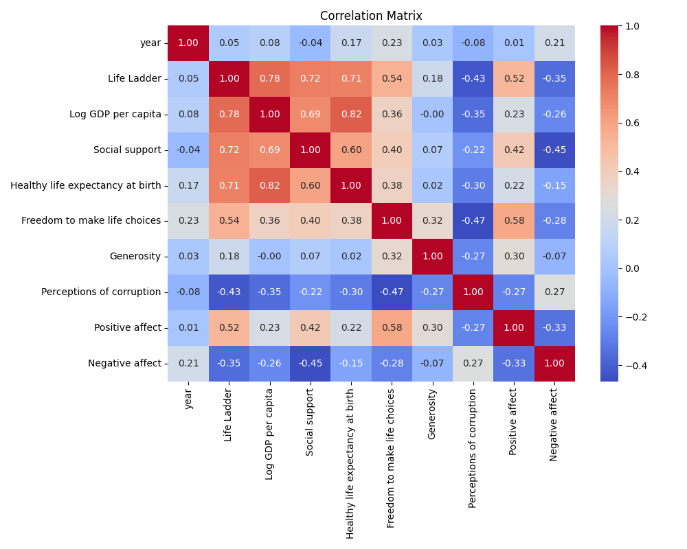

# Analysis of happiness.csv

## Dataset Overview
The dataset was loaded and analyzed dynamically. Below are the key findings:

- **Dataset Path**: `happiness.csv`
- **Shape**: 2363 rows and 11 columns.

## Analysis Highlights
### Correlation Matrix
The correlation matrix was analyzed to identify relationships between numerical features. A heatmap visualization has been generated:

### Insights from the LLM
The following insights were generated from the basic analysis:

## Outlier Analysis
Outliers were detected in the numerical columns using the IQR method. Further investigation may be necessary for columns with high deviation.

## Next Steps
Based on the analysis:
1. Investigate features with strong correlations for potential predictive modeling.
2. Address columns with significant outliers or missing data.
3. Explore advanced techniques like clustering or anomaly detection to uncover deeper patterns.

---

This README file summarizes the analysis. For further details, please refer to the dataset and visualizations.
